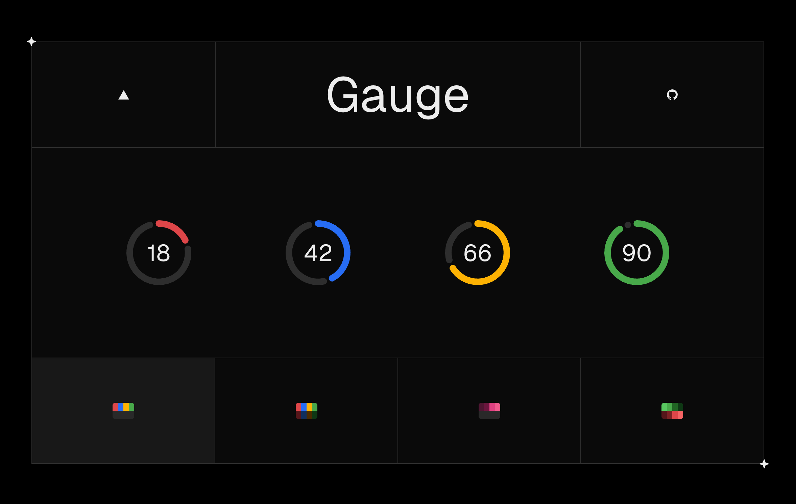

# Geist Gauge

This is a replication of Vercel's [Gauge](https://vercel.com/design/gauge) component from their Geist Design System. It can be used as a circular visual for conveying a percentage. You can view the demo here: https://gauge-demo.vercel.app.




## Installation

### Requirements

- Will work in any React application.
- Tailwind is NOT a requirement, but can be used to adjust the styling of this component through the className prop.
- This is a standalone component that you need to copy/paste to your codebase. I might make it an NPM package in the future. 


1. Copy the `gauge` component from here: [gauge.tsx](https://github.com/mfts/gauge-demo/blob/main/app/gauge.tsx)


2. Copy the required colors from [global.css](https://github.com/ajayvignesh01/geist-gauge). At minimum, you will need gray, red, amber, blue, and green.


3. Import into your page
   ```tsx
   import { Gauge } from "@/components/gauge";

   export default function Home() {
     return (
      <>
        // ...
        <Gauge value={75} className='size-24' />
        // ...
      </>
     )
   }
   ```


## API

The `Gauge` component requires a `value` prop and supports many others to customize it according to your needs.

- `value`: a **number** from `0` to `100` representing the current value of the gauge, expressed as a percentage.
- `size`: a **number** to represent pixels or a **string** like 100% to take up the parent containers dimensions, which is useful when you want to for example, dynamically size the gauge based on screen width using tailwind's breakpoint prefix classNames. Defaults to `"100%"`.
- `gapPercent`: a **number** to set the gap percent between primary and secondary arcs. Defaults to `5%`.
- `strokeWidth`: a **number** to set the arc thickness. Defaults to `10px`.
- `equal`: a **boolean** to determine whether the gauge should have equal primary and secondary arc lengths. Defaults to `false`.
- `showValue`: a **boolean** to determine whether the % value should be shown inside the gauge. Defaults to `true`.
- `primary` - a **string** color value for the primary arc. You can also pass an **array** with threshold values and the respective colors to make it dynamic. Defaults to a dynamic range with 25% steps going `red, amber, blue, green`.
- `secondary` - a **string** color value for the secondary arc. You can also pass an **array** with threshold values and the respective colors to make it dynamic. Defaults to a hue of `gray`.
- `transition` - an **array** of transition settings for the gauge's animation, specifying the length, step, and delay of transitions represented in ms. Defaults to `1000, 200, 0` respectively.
- `className` - a **string** to represent the className of the svg. You can also pass an **object** with svgClassName, primaryClassName, secondaryClassName, and textClassName for more customization.
- `props` - any other prop accepted by a React SVG element.


## Inspiration & Credits

- Thanks to the [@vercel](https://x.com/vercel) design team for the awesome component.
- Thanks to [@mfts](https://github.com/mfts/gauge-demo) work on the previous version of this component.